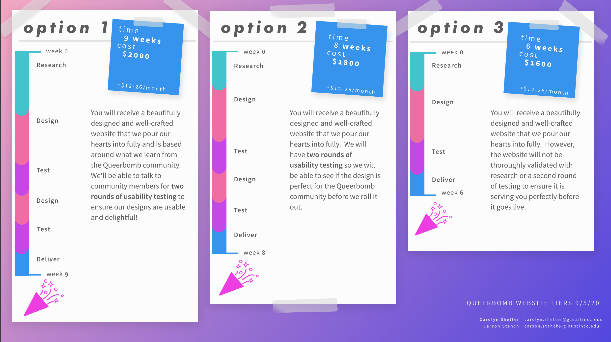

### Skills: Stakeholder Management, Facilitation

### Tools: Miro, Google Meet   

## First Project Progress

My partner, Carson Stanch, and I submitted a proposal to work with Queerbomb Austin to create their first website.  This was our first project outside of the classroom, and we learned how different the classroom is from a client.   

## Discovering Our Stakeholders' Needs
Carson and I met independently before our first client meeting to flesh out what we needed to discuss at the meeting and document what questions we had for the committee.  The first meeting we had with the website committee from Queerbomb was not what we had expected.

We spent a lot of the meeting discussing what they were looking for in the website, and initially they did not have a well-thought out answer.  As the meeting progressed our questions aided in laying out what the board was looking for in the site, but there was still confusion amongst themselves about their priorities for the website.

We decided to set a follow-up meeting to give the committee members time to meet separately and discuss priorities while Carson and I would create potential project plans to meet their needs.

## The Project Plan Options

Based on the needs of the committee and their budget constraints we created three different project plans with different price points that we explained to the committee as well as the organization at large.   

  

* **Option 1:** This is the most basic package that included all of their must-have items with only one round of user testing.  We were adamant about how this would deliver a viable website but may not be what the users expect.
* **Option 2:** This included two rounds of usability testing to ensure we could correctly incorporate the feedback we’d receive from the first round of testing.
* **Option 3:** This included a full two rounds of usability testing as well as a week of generative research to better understand how community members of queerbomb currently donate their time and money with other organizations in Austin.   

## The Pros and Cons of Our Approach

We created what we thought were helpful visuals depicting the timeline of the project for each project plan, but they were too heavy on jargon and confused our stakeholders.

The committee and organization at large were confused about why research was such an integral part of the process when they just wanted a website.
We justified our heavy emphasis on research with the sentiment that we weren’t building the website for the organization or for the committee, but we were building it for the participants of Queerbomb.  If we didn’t meet the needs of these people and create something without their input then the site could alienate users.

While we had persuaded the committee to the value of research we did not succeed with the organization at large.  The organization voted to choose the most basic option, which was disheartening for me as a researcher.  If you’d like to see how I adapted to this change, read my case study [User Testing with No Budget](https://carolynshetter.design/user-testing-with-no-budget).   

## Takeaways

- At the end of the process I realized that I struggled to convey the value of research because I didn’t tell a story about how research could help. The committee had preconceived ideas about what a “website designer” does, and our price increases made no sense to them in the narrative they held.  Educating future stakeholders on the value of research is one of the areas in which I am most eager to grow.
- I learned that I need to meet the stakeholder where they are at and do a great job as a UX Researcher regardless. Helping stakeholders discover their true needs is a part of the process and needs to be approached carefully and gracefully.
