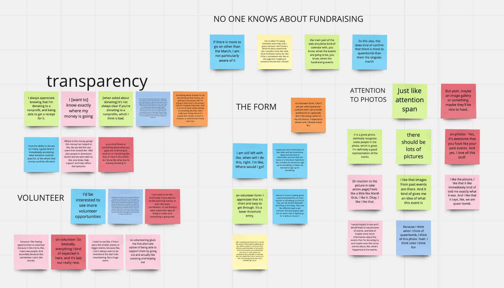
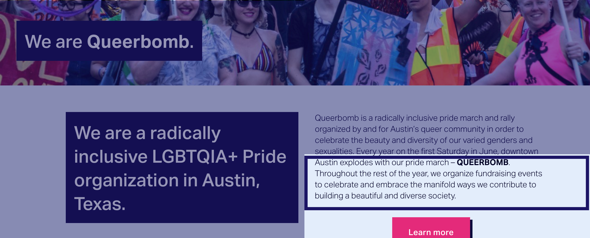

### Skills: Moderated User Testing, Data Synthesis, Data Analysis, Documentation   Tools: Google Meet, Otter.ai, Miro, Quicktime Screen Recording

***

## The Challenge

* We knew user testing was key for our success in building this site, but we didn’t have a budget.
* After discussing how to manage with some mentors we went for a lean approach to user testing.
* We didn’t have a ton of flows or a lot of content to test, so we opted for a more generative kind of user testing.
 

**We focused primarily on discovering how the mental models of actual users compared to how the site was designed.  After completing a prioritization grid for testing, we decided to focus on ensuring that the homepage, donation flow and volunteer sign up flow were pleasurable and usable.**

***

## Recruitment

We reached out to our personal social networks and online Austin community spots, ie Slacks, to find participants.  We were specific in prioritizing finding biracial, indigenous and people of color (BIPOC) LGBTQIA+ voices to test with because they were so important to the organization.

**BIAS WARNING:** Because there was no budget to properly recruit participants, we recognize that our findings could be influenced by the places we looked and could have confirmation bias.

***

## The Process

We conducted 9 interviews, with 44% of the interviewees identifying as BIPOC.  Each interview lasted 30 minutes, and included an interactive portion with the site.

We did an initial round of five interviews to get more generative user data on the mental models of the site.  The second round of testing with the four other participants was also generative, but we were able to confirm that the design changes we made solved the problems our previous participants had pointed out.

We did not have access to user testing software, so we went old fashioned.  Just kidding, old fashioned just means using Quicktime to record the sessions, meeting on Google Meet so participants could share their screen, and then using Otter.ai to transcribe the recording (they have a nice discount for students).  After the transcriptions were finished, we hand coded our findings into a google sheet, which were then added to our Miro board.

***

## The Findings and Their Effects
   

 With the findings in Miro I completed an affinity map as well as a gap analysis to parse out the interesting bits of data.

Our donation flow was well-received, and we confirmed that transparency is important to our users, regarding where their money would go. While we didn’t have that information readily available, we were able to pass this along to our stakeholders so that this could become a priority.  The committee ended up sending us their budget document for the 2019 fiscal year so that we could add to the site, which was a step in the right direction.

We were able to learn that 100% of participants did not know the Queerbomb had any other events than the main march in June for pride.  This was not something we were expecting and was great feedback for our stakeholders.  We updated the content above the fold on the homepage of the site in order to specify that beyond the march there were fundraising activities that took place in order to educate users, which you can see below.    

   

Participants were eager to donate their time to the organization, but the volunteer form that the organization had been using was confusing to our participants.

- *“It makes me nervous to sign up for something without having enough information. It makes me feel bad to sign up for something I may not be able to do.”*
    - Multiple-year attendee

Our participants were looking for more information on the upcoming events and the time constraints expected of them as volunteers.  Our stakeholders realized that their form was outdated and needed to be revamped thanks to the qualitative data the participants shared.

***

## Final Thoughts

* While the process of user testing was tedious and required a lot of planning it paid us back 100 fold by getting the useful feedback we received from our participants.

* The feedback was helpful for our stakeholders as well because it told the story of how real people, who care about Queerbomb, felt about the site and the organization. It gave the committee a chance to refocus their energy on what they could change, like writing their history or updating their volunteer form.
